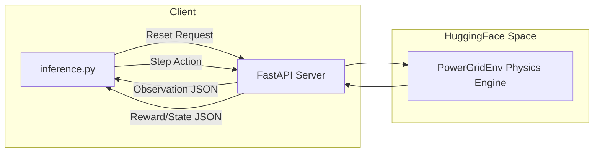

# ⚡ Power Grid Demand-Response Optimizer

A robust, ultra-low-latency real-world task environment built for the **Meta Scaler PyTorch & Hugging Face Hackathon**. 
This environment implements the full `OpenEnv` specification to simulate a Mixed-Source Power Grid. The goal for any agent is to keep the grid frequency stable at 50.0Hz while minimizing cost and carbon emissions.

## 🏗️ Architecture

The environment conforms to the OpenEnv client-server paradigm. 



## 🌍 Real-World Physics Assumptions
Our simulation relies on actual physics principles adapted for agent learning:
- **Frequency Inertia**: The grid naturally drifts towards 50.0Hz ($\Delta f = \frac{P_{net}}{2000} \times 0.5$) but an imbalance of Supply vs Demand causes immediate deviation.
- **Battery Capacity Limits**: Charging and discharging are hard-capped by physical limits (`max_flow = 200kW`). You cannot dump infinite power into a full battery.
- **Cost and Emission Impacts**: Using diesel explicitly hurts the environment (`0.5 tons CO2` equivalent proxy per unit) and grid trading hurts the wallet ($0.30+).

## 📊 Action & Observation Spaces

### Observation Space
The agent always perceives the immediate environment state alongside a **5-step forecast** to allow predictive reasoning:
- `current_demand_kw` (float): Present demand.
- `grid_frequency_hz` (float): Target 50.0. Drift < 49.0 leads to collapse.
- `spot_price_dollars` (float): Live grid buying cost.
- `battery_charge_level` (float): 0.0 (empty) to 1.0 (full).
- `forecast_solar_kw`, `forecast_wind_kw`, `forecast_demand_kw` (List[float]): Arrays predicting next 5 timesteps.

### Action Space
A continuous/discrete hybrid for nuanced control:
- `battery_flow` (float): `[-1.0, 1.0]` Full discharge to Full charge.
- `diesel_activation` (float): `[0.0, 1.0]` Off to Max capacity.
- `grid_trade` (float): `[-1.0, 1.0]` Sell to Buy.
- `shed_load_zone` (int): `[0, 1, 2]` Zone to drop entirely if in an emergency.

## 🚀 Setup & Execution

### Local Docker Build
You can run the environment locally via Docker:
```bash
docker build -t grid-optimizer .
docker run -p 8000:8000 grid-optimizer
```

### 1-Click Baseline Inference Command
To evaluate the baseline model against the deployed environment on HuggingFace:

```bash
export API_BASE_URL="https://api.openai.com/v1"
export MODEL_NAME="gpt-4o-mini"
export HF_TOKEN="your_hf_or_api_key_here"
export ENV_URL="http://127.0.0.1:8000" # Change to HF Space URL if remote

python inference.py
```
